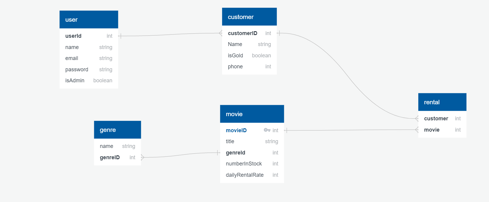

## Introduction

This project is the backend of Vidly, an imaginary video rental app.

---

---

## Demonstration
### 1) Genres
- Get All Genres
  * This route will return all the genres in the database.
  * Anyone can access this route.
- Get Movie
  * This route will return a specific genre's data by providing it's ID.
  * Anyone can access this route.
- Create New Movie
  * This route will allow the user to create new genre by providing name.
  * Only Logged in user can access this route.
- Update Movie
  * This route will allow the user to update a specific genre by providing it's ID.
  * Only Logged in user can access this route.
- Delete Move
  * This route will allow the user to delete a specific genre by providing it's ID.
  * Only Logged in user can access this route.
  
### 2) Customers
- Get All Customers
  * This route will return all the customers in the database.
  * Anyone can access this route.
- Get Movie
  * This route will return a specific customers's data by providing it's ID.
  * Anyone can access this route.
- Create New Movie
  * This route will allow the user to create new customer by providing name, phone and isGold(BOOLEAN true/false) Fields.
  * Only Logged in user can access this route.
- Update Movie
  * This route will allow the user to update a specific customer by providing it's ID.
  * Only Logged in user can access this route.
- Delete Move
  * This route will allow the user to delete a specific customer by providing it's ID.
  * Only Logged in user can access this route.

### 3) Movies
- Get All Movies
  * This route will return all the movies in the database.
  * Anyone can access this route.
- Get Movie
  * This route will return a specific movie's data by providing it's ID.
  * Anyone can access this route.
- Create New Movie
  * This route will allow the user to create new movie by providing it's title, genere ID, year, dailyRentalRate and numberInStock fields (optional fields: directors list / writers list / cast list).
  * Only Logged in user can access this route.
- Update Movie
  * This route will allow the user to update a specific movie by providing it's ID.
  * Only Logged in user can access this route.
- Delete Move
  * This route will allow the user to delete a specific movie by providing it's ID.
  * Only Logged in user can access this route.
  
### 4) Rental
- Get All Rentals
  * This route will return all the rentals in the database.
  * Anyone can access this route.
- Get Rental
  * This route will return a specific rental's data by providing the it's ID.
  * Anyone can access this route.
- Create New Rental
  * This route will allow the user to create new rental by providing the Movie's ID and the Customer's ID.
  * Only Logged in user can access this route.
- Update Rental
  * This route will allow the user to update a specific rental by providing it's ID.
  * Only Logged in user can access this route.
- Delete Rental
  * This route will allow the user to delete a specific rental by providing it's ID.
  * Only Logged in user can access this route.
- Return Rental 
  * Returning a Rental and create a new document in the return collection in the database and update the rental document.
  * Only Logged in user can access this route.
 
### 5) Users & Authentication
- User Login
  * User can login by sending his correct email and password.
  * Plain text password will compare with stored hashed password.
  * JWT and cookie should expire in 30 days.
  * Anyone can access SignIn route.
  * Once logged in, a token will be sent along with a cookie (token = xxx).
- User registration
  * Register as a "user" or "admin"
  * The user should enter the main data which is (name/email/role/password/passwordConfirm).
  * Once registered, a token will be sent along with a cookie (token = xxx)
  * Password is going to be hashed and saved into the database.
  * A message sent to the user's own email with the activation token of his email.
- User logout
  * Cookie will be sent to set token = none.
  * Only Logged in user can access this route.
- Fogot Password
  * When the user forget his password he can enter this route.
  * User should send his email.
  * The route will send an message to the user's email contains the reset password link (token).
  * Anyone can access this route.
- Reset Password
  * User can request to reset password.
  * A hashed token will be emailed to the users registered email address.
  * A put request can be made to the generated url to reset password.
  * The token will expire after 10 minutes.
  * Only Valid Tokens will allow the user to reset his password.
- Get current user data
  * Route to get the currently logged in user (via token).
  * Only Logged in user can access this route.
- Update Current User Data
  * This route allow the user to update his email and name only.
  * Only Logged in user can access this route.
- Delete Current User Data
  * This route allow the user to remove himself from the database, so he cannot login again.
  * Only Logged in user can access this route.
- Update user info
  * Separate route to update password.
  * Only Logged in user can access this route.
- Upload Current User Photo.
  * This route allow the user to upload his own avatar to the cloud and the database.
  * Only Logged in user can access this route.
- Delete Current User Photo.
  * This route allow the user to delete his own avatar from the cloud and the database.
  * Only Logged in user can access this route.
- Get User Avatar
  * This route will allow you to get user's avatar by providing user's ID.
- Confirm Email.
  * This route allow the user to active and confirm his Email.
  * Only user who have the confirmation token can active his email.
- User CRUD
  * Admin only can access these routes.

## Future Updates

* Create Front-End design for the api
* Improve authentication and authorization
* And More ! There's always room for improvement!

---
## Setup

Make sure to follow all these steps exactly as explained below. Do not miss any steps or you won't be able to run this application.

### Install MongoDB

To run this project, you need to install the latest version of MongoDB Community Edition first.

https://docs.mongodb.com/manual/installation/

Once you install MongoDB, make sure it's running.

### Install the Dependencies

Next, from the project folder, install the dependencies:

    npm i

### Populate the Database

    node seed.js

### Run the Tests

You're almost done! Run the tests to make sure everything is working:

    npm test

All tests should pass.

### Start the Server

    node index.js

This will launch the Node server on port 3900. If that port is busy, you can set a different point in config/default.json.

Open up your browser and head over to:

http://localhost:3900/api/genres

You should see the list of genres. That confirms that you have set up everything successfully.

### (Optional) Environment Variables

If you look at config/default.json, you'll see a property called jwtPrivateKey. This key is used to encrypt JSON web tokens. So, for security reasons, it should not be checked into the source control. I've set a default value here to make it easier for you to get up and running with this project. For a production scenario, you should store this key as an environment variable.

On Mac:

    export vidly_jwtPrivateKey=yourSecureKey

On Windows:

    set vidly_jwtPrivateKey=yourSecureKey
